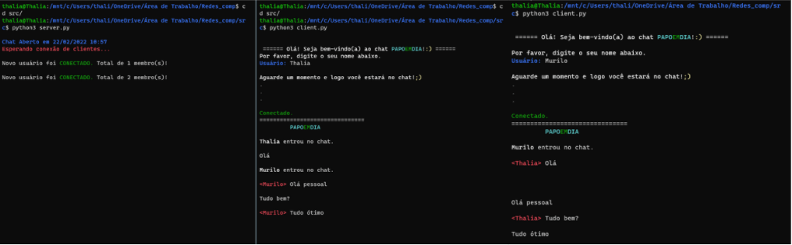

<h1 align="center">Chat PAPOEMDIA</h1>

Chat colorido e divertido, que armazena as conversas antigas estilo Discord!

# Tabela de conteúdos

<!--ts-->

- [Sobre](#Sobre)
- [Como usar](#como-usar)
  - [Pre Requisitos](#pre-requisitos)
  - [How to run](#how-to-run)
- [Considerações](#consideracoes)
- [Tecnologias](#tecnologias)
  <!--te-->

  

<h1>How to run</h1>

1- You'll have to install the latest version of Python in your terminal if it's not installed yet.

#Now you have to run the server

#In Powershell
2- python server.py
#In WSL
2- python3 server.py

#Now open a new terminal and it's time to connect a client, you can connect as much clients as you want.

#In Powershell
3- python client.py
#In WSL
3- python3 client.py

#------- CONSIDERATIONS -------
#If you want to desconnect a client, you'll have to close the terminal.
#You can't open more than one server.
